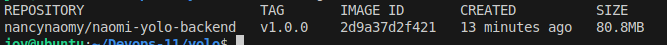
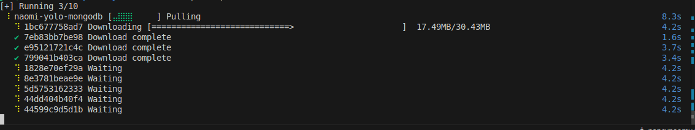
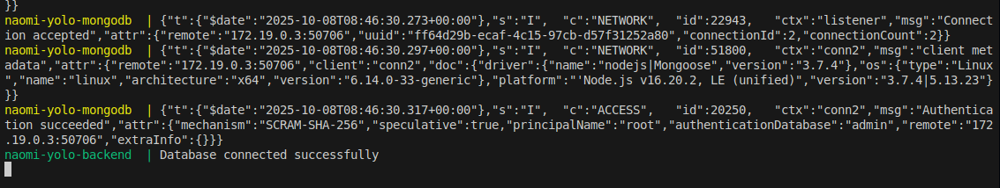
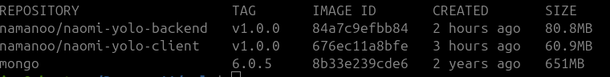
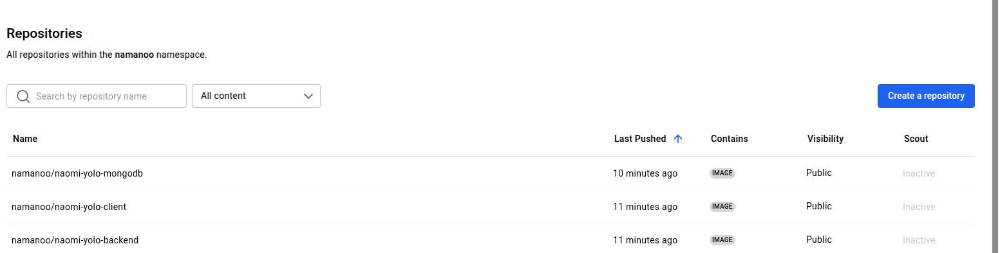
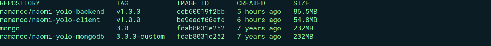

# Overview
This project demonstrates the containerization and deployment of a full-stack YOLO application using Docker.


# Requirements
Install Docker Engine by following the instructions here:
- [Docker Installation Guide](https://docs.docker.com/engine/install/)


## Building Each Container(microservices)
Before you start, ensure you are logged in to Docker Hub.

### 1. Client Dockerfile
Create the client Dockerfile and test the build with the following command:
```bash
docker build -t nancynaomy/naomi-yolo-client:v1.0.0 client/
```


The initial image size may be large, so optimization is recommended. After testing several base images, using `alpine:3.16.7` resulted in a significantly smaller image:


With further optimization, the image size was reduced to 60.9 MB:


### 2. Backend Dockerfile

Similarly, to build the backend image, use the following command:
```bash
docker build -t nancynaomy/naomi-yolo-backend:v1.0.0 backend/
```
The image is created successfully:



## Docker Compose file

Create a `docker-compose.yaml` file in the root folder:

```
yolo
   |__ compose.yaml
```

1. Define the client container as a service:
   - Bind the port:
     ```yaml
     ports:
       - "3000:3000"
     ```
   - Specify the build directory
   - Attach to a network

2. Define the backend container similarly and attach it to the same network.
3. Define a database container and connect it to the backend container using a separate network.

## Compose File Test and Build

The frontend and backend Docker images have been successfully created:


Next, we used Docker Compose to pull the database and build the services:

```bash
 docker compose up --build
```



a succesfull build 





The website is now accessible at `0.0.0.0:300`:


Image is persistent,,,, even if you restart the container.

Dockerhub images upload 


My final images




# USING VAGRANT AND ANSIBLE AUTOMATION IN THE YOLO APPLICATION PROJECT

## Overview

This repo automates deploying a containerized YOLO e-commerce site using Infrastructure as Code. Vagrant creates the VM, Ansible installs and configures everything, and Docker runs the app services — so you can get the entire system up and running with a single vagrant up.