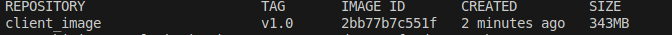
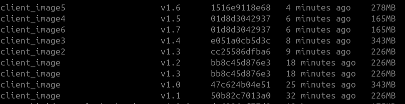
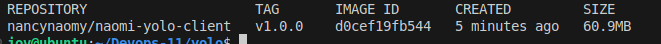

# Overview
This project involved the containerization and deployment of a full-stack yolo application using Docker.


# Requirements
Install the docker engine here:
- [Docker](https://docs.docker.com/engine/install/) 


## How to Build each Container
### 1. Client Dockerfile
Create clients Dockerfile and test the build using this command
```bash
docker build -t nancynaomy/naomi-yolo-client:v1.0.0 client/
```

The image size is quite big and we need to reduce the size.
Tested several images and working with `alpine:3.16.7`  gives us a small image


Further testing reduced my image to 60.9mb

