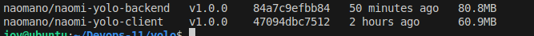

### Updated With Ansible automation

# Project Evolution
This project began as a containerized full-stack YOLO application built with Docker and Docker Compose, then automated using Vagrant and Ansible, and has now been extended to Kubernetes (GKE/Minikube) for full orchestration and scalability.


# Requirements
Install Docker Engine by following the instructions here:
- [Docker Installation Guide](https://docs.docker.com/engine/install/)


## Building Each Container(microservices)
Before you start, ensure you are logged in to Docker Hub.

### 1. Client Dockerfile
Create the client Dockerfile and test the build with the following command:
```bash
docker build -t nancynaomy/naomi-yolo-client:v1.0.0 client/
```


The initial image size may be large, so optimization is recommended. After testing several base images, using `alpine:3.16.7` resulted in a significantly smaller image:


With further optimization, the image size was reduced to 60.9 MB:


### 2. Backend Dockerfile

Similarly, to build the backend image, use the following command:
```bash
docker build -t nancynaomy/naomi-yolo-backend:v1.0.0 backend/
```
The image is created successfully:


## Docker Compose file

Create a `docker-compose.yaml` file in the root folder:

```
yolo
   |__ compose.yaml
```

1. Define the client container as a service:
   - Bind the port:
     ```yaml
     ports:
       - "3000:3000"
     ```
   - Specify the build directory
   - Attach to a network

2. Define the backend container similarly and attach it to the same network.
3. Define a database container and connect it to the backend container using a separate network.

## Compose File Test and Build

The frontend and backend Docker images have been successfully created:



Next, we used Docker Compose to pull the database and build the services:

```bash
 docker compose up --build
```


a succesfull build 


The website is now accessible at `0.0.0.0:300`:


Image is persistent,,,, even if you restart the container.

Dockerhub images upload 


My final images


# USING VAGRANT AND ANSIBLE AUTOMATION IN THE YOLO APPLICATION PROJECT

## Overview

This repo automates deploying a containerized YOLO e-commerce site using Infrastructure as Code. Vagrant creates the VM, Ansible installs and configures everything, and Docker runs the app services — so you can get the entire system up and running with a single vagrant up.


*1. Vagrant* creates the VM.

*2. Ansible* install dependencies and configure the application stack

*3. Docker* runs the app services All these enables you to get the entire system up and running with a single command:

```bash

vagrant up.

```
## Roles

**1. Common Role**

- Sets up the essential system tools and base configuration for Docker deployment.

*Tasks*

  - Configure base dependencies and updates system packages.

  - Setup Docker Compose tool and giving appropriate rights to owner andiInstalls git and docker.io.

  - Downloads and installs the latest version of Docker Compose.

  - Starts and enables the Docker service.

  - Creates a Docker network (yolo-network) to link all containers.

  - Clones the YOLO application repository from GitHub into /home/vagrant/yolo-app.

**2. Database Role**

- Deploys the MongoDB database container.

*Tasks*

  - Pulls the official MongoDB image (mongo:3.0).

  - Creates a container named mongo-db.

  - Exposes port **27017** internally for database communication.

  - Mounts a persistent volume mongo-data for data storage.

  - Connects the MongoDB container to the shared Docker network.

**3. Backend Role**

  - Runs the backend image that communicates with Database.

*Task*

  - Pulls the backend image: `namanoo/naomi-yolo-backend:v1.0.0`

  - Creates a container named `yolo_backend-container`.

  - Exposes port **5000** for API access.

  - Links to the database container through the network: `app-network`.

**4. Fontend Role**

- Deploys client react application

*Tasks*

  - Pulls Frontend  image from docker hub: `namanoo/naomi-yolo-client:v1.0.0`
  - It creates a container called `yolo-frontend1.
  - Then it maps guest port `80` to host port `3000`
  - it conect to same network as backend container for communication

  ## Project structure

  This is part of the structure where I am using ansible

```bash
├──roles/
    ├── backend
    │   └── tasks
    │       └── main.yml
    ├── common
    │   └── tasks
    │       └── main.yml
    ├── database
    │   └── tasks
    │       └── main.yml
    └── frontend
        └── tasks
            └── main.yml
├── Vagrantfile
├── ansible.cfg
├── playbook.yml
├── README.md
├──vars/
   └── main.yml
```

# Kubernetes Deployment
## Overview

The Kubernetes stage deploys the YOLO app using a multi-pod architecture:

MongoDB as a StatefulSet for persistent database storage

Backend as a Deployment (2 replicas) connected to Mongo via internal DNS

Frontend as a Deployment exposed via NodePort or Ingress

ConfigMap and Secret used for environment configuration and credentials

Namespace (yolo) used to isolate all project resources


# Author
**Naomy Nancy**

([Github account ](https://github.com/nancynaomy))
